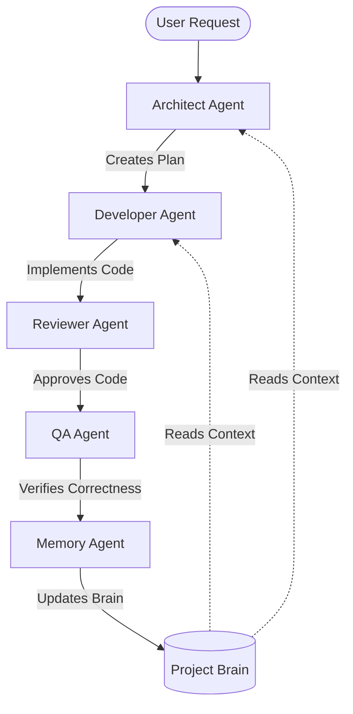

# Agent System

The project development and maintenance are driven by a multi-agent system. Each agent has specific responsibilities, inputs, and outputs to ensure architectural consistency and high-quality implementations.

---

## Agent Roles

### 1. Architect Agent
* **Responsibilities:**
  * Analyze feature requests and requirements.
  * Review existing architecture and dependency graph.
  * Generate details of the changes and dependency implications.
* **Output:**
  * `implementation-plan.md`

### 2. Developer Agent
* **Responsibilities:**
  * Write and refactor code according to the implementation plan.
  * Adhere to the styling guidelines, design system, and coding standards.
  * Utilize existing custom hooks and utility helper functions.
* **Input:**
  * Project Brain (specifically `master-memory.md`, `architecture.md`, and `patterns.md`)
  * `implementation-plan.md`

### 3. Reviewer Agent
* **Responsibilities:**
  * Review code submissions for quality, readability, and security.
  * Check for architectural compliance and pattern reuse.
  * Ensure no duplication of components or utilities.
* **Output:**
  * `review-report.md`

### 4. QA Agent
* **Responsibilities:**
  * Run automated test suites (Vitest, Playwright).
  * Write new test coverage for implemented features.
  * Verify builds and visual/functional correctness.
* **Output:**
  * `qa-report.md`

### 5. Memory Agent
* **Responsibilities:**
  * Update Project Brain files post-task.
  * Document new engineering decisions and approved patterns.
  * Capture bugs and mistakes to prevent recurrence.
  * Keep the compressed `master-memory.md` up-to-date and within size limits.
* **Output / Updates:**
  * `brain/memory.md`
  * `brain/patterns.md`
  * `brain/decisions.md`
  * `brain/mistakes.md`
  * `brain/master-memory.md`

---

## Agent Collaboration Workflow

