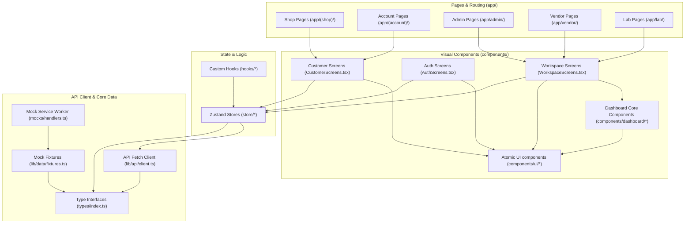

# Core Dependency Graph: Truzov

The flowchart below visualizes the architectural layout and dependency hierarchy within the Truzov application.

---

## Workspace Dependency Graph

---

## Core Dependency Rules

1. **Atomic Isolation:** Components inside `components/ui/` must remain pure visual blocks and should not import state stores (`store/`) or coordinate route page navigations directly.
2. **Uni-directional Data Fetching:** UI components fetch/push data using Zustand state stores or custom API fetch helpers, never accessing the raw MSW mock configurations directly.
3. **Types Priority:** Interfaces in `types/index.ts` must act as the source of truth for all schemas. No local TypeScript overrides.
