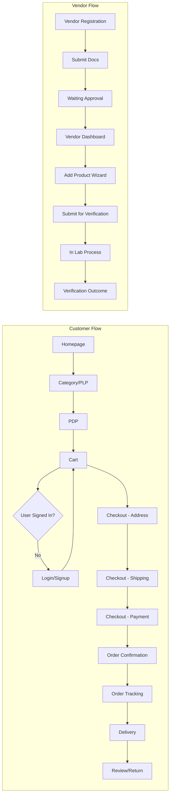

## Page 1

&lt;img&gt;ChatGPT&lt;/img&gt;

# Executive Summary

TRUZOV is a **verification-first health/organic marketplace**, combining familiar e-commerce flows (think Amazon) with trust-centric features (lab reports, certifications). The UI must blend Amazon-style usability (clear filters, prominent CTAs, dense information) with visual cues for authenticity (trust badges, report links, transparency sections).

This master brief details **all Figma files and frames**, content for key screens, component inventory, user flows, and instructions for an AI (Stitch) to generate **production-ready** designs. It is organized into:

*   **Figma File List & Frames** – one file per module (Design System, Customer Site, Checkout, Account, Vendor, Admin, Verification, plus Mobile/Edge States), with every frame name and purpose.
*   **Critical Screens Specs** – for Homepage, PLP, PDP, Cart, Checkout steps, Vendor Add-Product wizard, Admin Verification Kanban: exact layout regions, components, text, CTAs, and error states.
*   **Component Inventory** – table of key components (buttons, cards, badges, etc.) with variants/props, naming conventions, auto-layout rules, spacing/typography/color tokens.
*   **Prototype Flows** – mermaid flowcharts for Customer, Vendor, and Admin journeys.
*   **Stitch Prompt Guide** – concise prompt text for each file, design style keywords, export settings, and acceptance checklist.

All screens prioritize **conversion and trust**. Layouts are dense, Amazon-like, but with a premium/clinical feel. Trust badges ("Lab Verified"), certification tags, and report previews are pervasive. Spacing follows an 8-point grid; typography is modern (Inter or similar); colors use greens/beiges for health, and neutral grays. Components use Auto Layout and clear naming (e.g. `Button/Primary`, `Card/Product`).

Below is the complete breakdown.

## 1. Figma File Structure

<table>
  <thead>
    <tr>
      <th>File Name</th>
      <th>Description</th>
    </tr>
  </thead>
  <tbody>
    <tr>
      <td>00 - Design System</td>
      <td>Colors, typography, spacing, UI components (buttons, inputs, badges, cards, etc.).</td>
    </tr>
    <tr>
      <td>01 - Customer Site (Web)</td>
      <td>Public pages: Homepage, category listings, search, PLP, PDP, Trust pages, etc.</td>
    </tr>
    <tr>
      <td>02 - Authentication</td>
      <td>Login/signup flows for Customer, Vendor, Admin (including OTP/MFA screens).</td>
    </tr>
    <tr>
      <td>03 - Customer Shopping</td>
      <td>Cart and multi-step Checkout (address, shipping, payment, review).</td>
    </tr>
    <tr>
      <td>04 - Customer Account</td>
      <td>My Orders, Order Detail, Profile, Addresses, Reviews, Returns, Settings.</td>
    </tr>
  </tbody>
</table>

&lt;page_number&gt;1&lt;/page_number&gt;

---

## Page 2

<table>
  <thead>
    <tr>
      <th>File Name</th>
      <th>Description</th>
    </tr>
  </thead>
  <tbody>
    <tr>
      <td>05 - Vendor Dashboard</td>
      <td>Vendor onboarding + dashboards: Add/Edit Product, Inventory, Orders, Analytics, Verification status.</td>
    </tr>
    <tr>
      <td>06 - Admin Panel</td>
      <td>Admin operations: Dashboard, Vendor Management, Product & Verification queues, Orders, Content config.</td>
    </tr>
    <tr>
      <td>07 - Lab Verification System</td>
      <td>Dedicated flow for lab testing: Request form, Sample tracker, Lab report upload, Admin review, History.</td>
    </tr>
    <tr>
      <td>08 - Mobile (Responsive)</td>
      <td>Mobile versions for key flows (Homepage, PLP, PDP, Cart, Checkout, Account, Vendor, Admin).</td>
    </tr>
    <tr>
      <td>09 - Edge & States</td>
      <td>Error, empty, loading, out-of-stock, unauthorized, and other system states for modules.</td>
    </tr>
    <tr>
      <td>10 - Prototype Map</td>
      <td>Flowcharts linking major frames: Customer, Vendor, Admin prototypes (for presentation only).</td>
    </tr>
  </tbody>
</table>

Each file contains frames named exactly as specified below (copy-paste ready), with a short purpose. In Figma, use these as frame names under each page.

### 1.100 - Design System

*   **Type/Heading 1** - Main page title style.
*   **Type/Heading 2** - Secondary heading style.
*   **Type/Heading 3, 4, 5, 6** - Subsequent headings.
*   **Type/Body** - Normal paragraph text.
*   **Type/Caption** - Small text.
*   **Color/Primary** - Brand green (#1F7A1F).
*   **Color/Secondary** - Accent beige (#F5EBDD).
*   **Color/Success, Warning, Error** - Status green/orange/red.
*   **Spacing/0-64** - 4px-based spacing scale (4px, 8px,...,64px).
*   **Button/Primary** - Primary CTA button variant.
*   **Button/Secondary** - Secondary CTA.
*   **Button/Ghost** - Outline/ghost style.
*   **Input/Text** - Text input field.
*   **Input/Dropdown** - Dropdown menu.
*   **Badge/Lab Verified** - "Lab Verified" label (green).
*   **Badge/Pending** - "Verification Pending" (orange).
*   **Badge/Rejected** - "Verification Rejected" (red).
*   **Card/Product** - Product card (image, title, price, badge).
*   **Card/Lab Report** - Report preview (summary of lab results).
*   **Card/Seller** - Vendor info card.
*   **Modal/Standard** - Base modal overlay.
*   **Toast/Success, Error** - Feedback messages.
*   **Tab/Navigation** - Tab component.
*   **Table/Default** - Data table style (for admin/vendor lists).
*   **Icon/Star** - Rating star icon.
*   **Icon/Verification** - Trust icon (shield check).
*   **Filter/Sidebar** - Collapsible sidebar panel.
*   **Stepper/Progress** - Checkout progress bar component.

&lt;page_number&gt;2&lt;/page_number&gt;

---

## Page 3

(Use Auto Layout for lists and forms. Buttons: padding 16x (horizontal) 12x (vertical). Grid: 12 columns, 24px gutters.)

### 1.2 01 – Customer Site (Web)

*   **Home – Hero** – Homepage top section (CTA, hero image, trust tagline).
*   **Home – Categories** – Category cards section.
*   **Home – Featured Products** – “Featured” carousel/card list.
*   **Home – How It Works** – Steps or infographics.
*   **Home – Footer** – Footer links and info.
*   **Category – [Name]** – Category landing (e.g. Honey, Spices) with banners, featured items.
*   **Search Results** – Search results page with filters.
*   **PLP – [Category]** – Product Listing (e.g. “Honey PLP”).
*   **Product – [Name]** – Product Detail (PDP) for a specific item.
*   **Trust – About Us** – “About / Mission” page.
*   **Trust – How It Works** – Explanation of verification process.
*   **Contact/FAQ** – Support page.

(Frame names like “PLP – Honey” can be adjusted to actual categories. Each PLP should follow same structure.)

### 1.3 02 – Authentication

*   **Login – Customer** – Customer sign-in.
*   **Signup – Customer** – Customer registration.
*   **Forgot Password** – Email entry to reset.
*   **OTP Verification** – Enter one-time code.
*   **Reset Password** – Set new password.
*   **Login – Vendor** – Vendor login (email/password).
*   **Signup – Vendor** – Vendor application start.
*   **KYC Upload – Vendor** – Upload GST/FSSAI docs.
*   **Pending – Vendor** – Awaiting approval notice.
*   **Login – Admin** – Admin login page.
*   **Admin MFA** – Admin multi-factor auth screen.

### 1.4 03 – Customer Shopping

*   **Cart** – Shopping cart page.
*   **Checkout – Address** – Enter/select delivery address.
*   **Checkout – Shipping** – Choose shipping options.
*   **Checkout – Payment** – Payment method form (UPI, card).
*   **Checkout – Review** – Order summary before payment.
*   **Checkout – Success** – “Thank you” confirmation.
*   **Checkout – Failure** – Payment error message.
*   **Order Confirmation** – Confirmation page (order #, summary).
*   **Order Tracking** – Tracking timeline page.
*   **Submit Review** – Post-delivery review form.
*   **Return Request** – Initiate a return/refund.

### 1.5 04 – Customer Account

*   **Account – Profile** – Edit profile (name, email).

&lt;page_number&gt;3&lt;/page_number&gt;

---

## Page 4

* Account - Orders List - List of past orders.
* Account - Order Detail - One order's details.
* Account - Addresses - Manage saved addresses.
* Account - Wishlist - Saved products.
* Account - Reviews - Submitted reviews list.
* Account - Returns - Status of return requests.
* Account - Security - Change password, 2FA.
* Account - Notifications - Email/SMS preferences.

**1.6 05 - Vendor Dashboard**

* Vendor - Onboarding - Multi-step sign-up (details, docs).
* Vendor - Dashboard - Overview with sales, orders summary.
* Vendor - Products List - Table of products (status icons).
* Vendor - Add Product Step 1 - Basic Info form.
* Vendor - Add Product Step 2 - Images upload.
* Vendor - Add Product Step 3 - Pricing & inventory.
* Vendor - Add Product Step 4 - Tax/attributes.
* Vendor - Submit Product - Confirmation page.
* Vendor - Product Detail - View/edit a product.
* Vendor - Inventory - SKU/stock management table.
* Vendor - Orders List - Table of orders.
* Vendor - Order Detail - Specific order, print label.
* Vendor - Payouts - Payment history.
* Vendor - Analytics - Charts (revenue, top products).
* Vendor - Verification Tracker - Status list (Submitted, In Lab, etc.).

**1.7 06 - Admin Panel**

* Admin - Dashboard - Metrics (revenue, orders, pending tasks).
* Admin - Vendors List - Table of vendors.
* Admin - Vendor Detail - Approve/reject vendor.
* Admin - Products Queue - Products awaiting approval.
* Admin - Product Detail - Inspect product + lab data.
* Admin - Verification Kanban - Columns: Submitted, Samples Collected, In Lab, Report Uploaded, Approved, Rejected.
* Admin - Orders List - All orders with filters.
* Admin - Order Detail - Order management (refund/cancel).
* Admin - Content Mgmt - Edit homepage banners, FAQ, etc.
* Admin - Configurations - Settings (commissions, zones).
* Admin - Roles & Permissions - Add sub-admins.

**1.8 07 - Lab Verification System**

* Lab - New Request - Vendor submits sample details.
* Lab - Assign Lab - Admin assigns a lab partner.
* Lab - Collection Tracker - Status of sample pickup.
* Lab - Upload Report - Lab uploads PDF/results.
* Lab - Review Report - Admin view of results & flags.
* Lab - Decision - Approve or reject product.
* Lab - History Timeline - All verification events for a product.
* Lab - Customer Report View - How customer sees report excerpt on PDP.

&lt;page_number&gt;4&lt;/page_number&gt;

---

## Page 5

1.9 08 – Mobile (Responsive)

For each of the above major flows (01–04), design mobile screens. Example frames:

*   M/Home – Hero
*   M/PLP – Honey
*   M/PDP – [Name]
*   M/Cart
*   M/Checkout – Payment
*   M/Order Tracking
*   M/Account – Orders
*   M/Vendor – Dashboard
*   M/Admin – Dashboard

1.10 09 – Edge & States

*   Empty – PLP – No products found.
*   Empty – Cart – Your cart is empty.
*   Error – 404 – Page not found.
*   Error – 500 – Server error.
*   Locked – Unauthorized – “Please login”.
*   Disabled – Product – Product inactive/out of stock.
*   Pending – Verification – Product awaiting lab.
*   Rejected – Product – Cannot buy (rejected).
*   Empty – Orders – No orders yet.
*   Empty – Vendor – No products listed yet.
*   Loading – Generic skeleton/loading.

(Each of these is a frame on the Edge/States page.)

2. Critical Screens Specs

The following screens are **highest priority**. Each spec lists regions/components, content, and fallback states.

2.1 Homepage (Customer)

Layout Regions:

*   **Header/Nav**: Logo left, search bar center, cart/account icons right (sticky top).
*   **Hero Banner**: Full-width image or illustration with tagline (“Every product lab-verified”) and primary CTA (“Shop Now”).
*   **Category Row**: Iconic cards for top categories (Honey, Dairy, etc.) with images and short titles.
*   **Featured Section**: Horizontal carousel or grid of top products (with “Best Seller” filter or picks).
*   **How It Works**: 3-4 step infographic (Order→Lab Test→Deliver).
*   **Trust Strip**: Icons/text (e.g. “Certified Organic”, “Secure Checkout”, “Free Returns”).
*   **Footer**: Links (About, FAQ, Contact), social icons, legal links.

**Components Needed**: Navbar (with Search), Button/Primary, Button/Secondary, Category Card, Product Card, Trust Badge Icons, Footer links.

&lt;page_number&gt;5&lt;/page_number&gt;

---

## Page 6

**Copy Examples:**

*   Hero Title: "The Healthiest Marketplace. Every product certified by labs."
*   Hero CTA: "Browse Verified Products".
*   Category Card Label: "Honey".
*   Trust Items: "☑ Third-party lab testing", "☑ Secure checkout".

**Data Fields:** If user location known, show location zip; otherwise generic "Nationwide shipping."

**CTAs:** Primary (e.g. "Shop Honey", "Explore Products"). Secondary ("Learn More" about verification).

**Empty/Error States:** If no featured products, show placeholder "Coming soon." If categories not loaded, placeholder cards.

## 2.2 PLP – Product Listing Page

**Example:** PLP – Honey

**Layout Regions:**

*   **Breadcrumbs** at top ( Home > Honey ).
*   **Filters Sidebar (left):** Collapsible panel with filters: category (if sub-categories), Brand, Price (range slider), Certification (Organic/Non-GMO), Lab Verified (toggle), Rating, etc.
*   **Sorting Bar (top of grid):** Dropdown (Sort by relevance/price/rating), view toggle (grid/list).
*   **Product Grid (right):** 3-4 columns on desktop, with uniform cards.

**Product Card Components:**

*   Image (with lazy-load fallback).
*   Title (truncated 2 lines if needed).
*   Rating stars + number (e.g. 4.5 ★ (120)).
*   Price (highlight with discount if any).
*   "Lab Verified" Badge (green) if product is verified.
*   Delivery info (fast delivery text or icon).
*   "Add to Cart" button (on hover or always visible).
*   **Data:** Show if "In Stock" or "Out of Stock." Gray out if out.

**Copy Examples:**

*   Card Title: "Wildflower Honey (500g) – GLF Organic".
*   Price: "₹599 ₹799 (25% off)" or "₹599".
*   Badge Tooltip: "Verified by third-party labs for purity.".

**Interactions:**

*   Clicking title/image goes to PDP.
*   Quick-add (if space) to cart from card.

**Empty/No Results:**

*   Display "No products found matching your filters." with a "Clear Filters" option.

&lt;page_number&gt;6&lt;/page_number&gt;

---

## Page 7

## 2.3 PDP – Product Detail Page
(The most critical page)

**Layout Regions:**

*   **Breadcrumb & Nav:** As above.
*   **Left Column:** Large Image Gallery (main image + thumbnails). Zoom on hover/click.
*   **Center Column:** Product info: Title, rating, price, short highlights.
*   **Right Column (Sticky Purchase Box):** Price, stock status, quantity selector, Add to Cart, Buy Now. If user location selected, show delivery estimate (e.g. “Delivery by May 10”). Also show small vendor name/link.
*   **Below Title: Trust Banner:** Prominent “Lab Verified” badge/icon near price; a one-line summary of test (e.g. “Lab Tested: 99.8% purity, pesticide-free.”).

**Tabs/Sections:**

*   **Details:** Long description, bullet key features, ingredients, certifications logos (Organic, FSSAI).
*   **Lab Report:** Summary metrics (e.g. “Pesticides: ND, Heavy Metals: ND”), link/button “Download Full Report (PDF)”. Show thumbnail of report page.
*   **Reviews:** User reviews list with “Write a Review” CTA.
*   **Shipping & Returns:** Info text about return policy.

**Components:**

*   Product Image Carousel,
*   Badge (“Lab Verified” / “Certification”),
*   Tabs,
*   Rating stars,
*   Quantity selector (input + +/-),
*   Secondary Buttons,
*   Accordion (for long info if needed).

**Copy Examples:**

*   Title: “Pure Honey – Organic Wildflower (500g)”.
*   Highlights: “100% natural | FSSAI certified | No preservatives”.
*   Price: “₹499”.
*   Verified Tooltip: “Third-party lab test confirms purity.”.
*   Add to Cart CTA: “Add to Cart”.
*   Buy Now CTA: “Buy Now”.
*   Lab Metrics: “Heavy Metals: Not Detected”; “Pesticides: Not Detected”.
*   Review Section Placeholder: “Be the first to review this product.” if no reviews.

**Error/States:**

*   If **out of stock:** disable Add to Cart, show “Currently unavailable” message.
*   If **verification pending:** show an orange “Verification Pending” and disable Buy (with tooltip “Product under review”).

&lt;page_number&gt;7&lt;/page_number&gt;

---

## Page 8

*   If no lab report: hide or gray out the Download link with note "Lab report will be available after testing.".
*   If errors (e.g. image fails to load), show default placeholder images.

## 2.4 Cart Page

**Layout Regions:**

*   **Cart Items List (left):** Table or stacked list of products, each with thumbnail, title (link to PDP), quantity selector, price, Remove link.
*   **Summary (right):** Order subtotal, taxes, shipping (estimated or $0), total, promo code input, **Checkout Button** (primary, sticky on scroll).

**Components:**

*   Product Row with image, text.
*   Quantity input.
*   "Remove" link/button.
*   Price breakdown.
*   Promocode field + Apply button.
*   Primary CTA "Proceed to Checkout".

**Copy Examples:**

*   "You have 3 items in your cart."
*   Remove text: "Remove".
*   Promo placeholder: "Enter code".
*   Checkout CTA: "Checkout".

**Empty State:**

*   If no items, show "Your cart is empty" with link "Start Shopping".

**Error States:**

*   If any item is out-of-stock: show a warning icon and text "This item is out of stock". Offer "Save for later" or disable its quantity.
*   If quantity max is reached: show "Only X left".
*   If promo invalid: inline error message.

## 2.5 Checkout Steps

**General:** Multi-step with progress indicator. Use either single-page accordion or multi-page with back/next. Steps: Address → Shipping → Payment → Review.

### 2.5.1 Checkout - Address

*   **Fields:** Saved addresses dropdown; "Add New Address" button opening form (name, address lines, pincode, phone).
*   **CTA:** "Next" (disabled until address selected).
*   **Validation:** Inline for required fields, pincode format.

&lt;page_number&gt;8&lt;/page_number&gt;

---

## Page 9

2.5.2 Checkout - Shipping
*   **Fields:** Shipping options list (e.g. Standard (5-7 days, ₹30), Express (2 days, ₹50)). Show delivery estimate per choice.
*   **Info:** Itemized shipping cost in summary.
*   **CTA:** "Next".

2.5.3 Checkout - Payment
*   **Methods:** Tabs or list of options (UPI, Credit/Debit Card, Netbanking, COD).
*   **If Card:** show card input fields (number, expiry, CVV).
*   **If UPI:** field for UPI ID or show QR.
*   **If COD:** show note "Cash on Delivery available".
*   **Secure Trust Note:** "Payments secured by Razorpay".
*   **CTA:** "Pay Now" (shows Razorpay popup).
*   **Error:** If payment fails, show error and "Try Again" or alternative.

2.5.4 Checkout - Review
*   **Layout:** Summary of items, shipping address, selected shipping, total price.
*   **Edit Buttons:** to go back and change items, address, or payment.
*   **CTA:** Final "Place Order".

2.5.5 Payment Result
*   **Success:** Show order number, summary, "Continue Shopping".
*   **Failure:** Show error (with icon), "Payment failed. Please try again or use another method.".

2.6 Vendor - Add Product Wizard
Multi-step form (at least 4 steps). Layout: Step header with progress (Step 1 of 4, etc.).

**Step 1: Basic Info**
*   **Fields:** Product name, brand, category selector (with subcats), description (rich text), tags.
*   **Validation:** Required fields, max lengths.

**Step 2: Images**
*   **Upload slots:** Up to 5 images, with drag-drop.
*   **Preview:** Thumbnail preview with delete.
*   **Guidelines:** Text hint "White background preferred (1000x1000px)".

**Step 3: Pricing & Inventory**
*   **Fields:** Price (MRP, sale price), Unit/Weight, Stock quantity, SKU.
*   **Toggle:** "Enable COD" (if applicable).
*   **Alert:** Low stock warning if quantity is small.

**Step 4: Lab & Compliance**
*   **Fields:** Declare if product has known lab results (Yes/No).
*   **Upload:** PDF certificate (optional).

&lt;page_number&gt;9&lt;/page_number&gt;

---

## Page 10

*   Button: "Submit for Verification".

**Step 5: Confirmation**
*   Message: "Product submitted! It will be reviewed and tested. Status: Pending."
*   Next CTA: "Return to Dashboard".

**Copy Examples:**
*   Step instructions like "Add clear photos of your product", "Ensure all details are accurate".
*   Button: "Save & Continue", "Submit for Verification".

**Error/Validation:**
*   Show inline errors for missing required info or invalid formats.
*   If image upload fails (size too large), show message.
*   If vendor tries to submit incomplete form, highlight missing.

**2.7 Admin - Verification Kanban**

**Layout:** Full-width Kanban board with columns:
*   **Submitted:** New products awaiting sample.
*   **Sample Collected:** Collection scheduled/complete.
*   **In Lab:** Testing in progress.
*   **Report Uploaded:** Lab has uploaded results.
*   **Approved:** Verification done.
*   **Rejected:** Failed (with reason badge).

**Card Contents:** Each card = product submission:
*   Thumbnail, product name, vendor name, submission date.
*   **On hover/click:** Expand details: product claims vs. lab results.
*   **Drag & Drop:** Move card to next column when process advances.

**Components:** Board UI (columns, cards), Badges for status, **Approve/Reject** buttons inside cards.

**Data Fields:** For each submission, track timestamps, lab partner name.

**Copy:** Column headers clearly labeled.
*   Buttons: "Approve", "Reject", "View Report" inside card (or on open).
*   Confirm modals: "Are you sure? Once approved, product goes live." with comment field for rejection reason.

**Empty Column State:** "No items in this stage" if empty.

**Error State:** If a card fails loading details, show "Error loading report." with retry.

&lt;page_number&gt;10&lt;/page_number&gt;

---

## Page 11

# 3. Component Inventory

The design system includes these key components (with variants/props). All use Auto Layout (horizontal or vertical) and standard naming:

<table>
  <thead>
    <tr>
      <th>Component</th>
      <th>Variants/Props</th>
      <th>Notes (Naming, Auto Layout)</th>
    </tr>
  </thead>
  <tbody>
    <tr>
      <td><strong>Button</strong></td>
      <td>Primary (filled), Secondary (outline), Disabled, Text-only</td>
      <td>Name: <code>Button/Primary</code>, <code>Button/Secondary</code>, etc. Padding (LR:16, TB:12). Corner radius 6px. Auto Layout centered.</td>
    </tr>
    <tr>
      <td><strong>Input Field</strong></td>
      <td>Normal, Focused, Error</td>
      <td><code>Input/Text/Default</code>, <code>/Focused</code>, <code>/Error</code>. Full-width containers. Label above, field area with 4px border radius.</td>
    </tr>
    <tr>
      <td><strong>Product Card</strong></td>
      <td>Default, Hover (shadow uplift)</td>
      <td><code>Card/Product/Default</code>, <code>/Hover</code>. Props: image, title, price, badge, rating. Grid auto-layout (vertical stack).</td>
    </tr>
    <tr>
      <td><strong>Badge/Label</strong></td>
      <td>Lab Verified, Pending, Rejected, Custom</td>
      <td><code>Badge/Verified</code>, <code>/Pending</code>, <code>/Rejected</code>. Solid background + text. 4px padding.</td>
    </tr>
    <tr>
      <td><strong>Tabs</strong></td>
      <td>Default, Selected</td>
      <td><code>Tabs/Default</code> with lines. Use icon+text or text only. Auto Layout row.</td>
    </tr>
    <tr>
      <td><strong>Table</strong></td>
      <td>Row states (hover, selected)</td>
      <td>Named columns (e.g. "Vendors"), body rows. Use Auto Layout per row.</td>
    </tr>
    <tr>
      <td><strong>Filter Sidebar</strong></td>
      <td>Collapsible sections</td>
      <td>Panels with checkboxes, sliders, toggles. Title bold.</td>
    </tr>
    <tr>
      <td><strong>Modal</strong></td>
      <td>Standard (centered), Fullscreen (mobile)</td>
      <td><code>Modal/Default</code>. Padding 24px. Overlays with 50% black.</td>
    </tr>
    <tr>
      <td><strong>Toast</strong></td>
      <td>Success (green), Error (red)</td>
      <td>Appear top-right. <code>Toast/Success</code>, <code>/Error</code>. Auto dismiss icon.</td>
    </tr>
    <tr>
      <td><strong>Stepper</strong></td>
      <td>Checkout progress (horizontal steps)</td>
      <td><code>Stepper/Checkout</code>. Numbered circles + labels. Use Auto Layout horizontally.</td>
    </tr>
    <tr>
      <td><strong>Tooltip</strong></td>
      <td>Text small popover</td>
      <td><code>Tooltip/Info</code>. Arrow pointer, small font.</td>
    </tr>
  </tbody>
</table>

**Naming Conventions:**
Use clear, descriptive names with slashes. E.g. <code>Button/Primary/LoggedIn</code>, if variant needed. Tokens (colors, spaces) in separate page for reuse.

**Auto-Layout Rules:**
* Use H/V Auto Layout for cards and lists.
* Spacing: 16px gaps between elements; 24px between major sections.
* Grid: 12-col on desktop frames (set width 1440px with 24px margin).
* Center content in modals/pages.

&lt;page_number&gt;11&lt;/page_number&gt;

---

## Page 12

Spacing & Grid:
* 8pt (4px) base: define Space/1 =4px, Space/2 =8px, etc. Typically use 8px, 16px, 24px increments.
* Columns: 12 columns, 24px gutters, 20px side margins.

Typography Scale:
* H1 (32px), H2 (24px), H3 (20px), H4 (18px), H5 (16px bold), H6 (14px bold).
* Body text 16px, captions 12px.
* Line-height ~1.5.

Color Tokens:
* Primary: #1F7A1F (dark green) - e.g. Color/Primary.
* Secondary: #F5EBDD (beige).
* Accent: #477DCA (blue accent for links/buttons).
* Neutral: Gray scale (#FFFFFF, #F0F0F0, #CCCCCC, #333333).
* Success: #218838 (green),
* Warning: #E0A800 (orange),
* Error: #C82333 (red).

(Define tokens as Figma Color Styles or variables.)

## 4. Prototype Flows (Mermaid Charts)

&lt;page_number&gt;12&lt;/page_number&gt;

---

## Page 13

V8 --> V9{Approved?}
V9 -- Yes --> V10[Product Live]
V9 -- No --> V11[Fix & Resubmit]
V4 --> V12[Orders List] --> V13[Order Detail]
V13 --> V14[Generate Label/Dispatch]
V4 --> V15[Analytics & Payouts]
end

subgraph Admin Flow
A1[Admin Login] --> A2[Dashboard]
A2 --> A3[Vendor Management]
A3 --> A4[Vendor Approval]
A2 --> A5[Product Approvals]
A5 --> A6[Verification Queue (Kanban)]
A6 --> A7[Lab Report Review]
A7 --> A8[Approve/Reject Product]
A2 --> A9[Orders Management]
A9 --> A10[Refunds/Disputes]
A2 --> A11[Content Settings]
A11 --> A12[Site Configurations]
end

(Clicking arrows: implement via Figma prototyping between named frames.)

## 5. Output Instructions for Stitch

For each Figma file, prepare a concise prompt that tells the AI tool the file's scope, style, and export settings:

*   **File “Design System”**: Prompt: “Create a complete design system for a health/organic marketplace. Use clean, conversion-focused style (8px grid, neutral backgrounds, green accent). Include color palette, typography scale, and reusable components (buttons, inputs, badges, cards, tables, etc.) in Auto Layout with clear naming.”
    *   Style tokens: Amazon-like clarity + premium health (greens, whites).
    *   Export: Ensure components are Figma-ready (styles, variants).
    *   Acceptance: All components listed above present, naming as specified.

*   **File “Customer Site (Web)”**: Prompt: “Design desktop web screens for an Amazon-style organic marketplace (brand: TRUZOV). Include Homepage, Category page (e.g. Honey), Search/PLP, PDP, Trust pages. Use conversion-optimized layout (filter sidebar, product grid) and emphasize trust (lab-verified badges, report links).”
    *   Style: Friendly, trustworthy, dense UI.
    *   Export: Frames named exactly as above, with grids and components.
    *   Acceptance: Header with search, footer, correct frame names.

*   **File “Checkout & Orders”**: Prompt: “Design the checkout and order flow for TRUZOV. Include Cart, multi-step checkout (address, shipping, payment, review), order confirmation, tracking, review submission. Use clear progress bar, sticky summary, secure payment UI (Razorpay style).”

&lt;page_number&gt;13&lt;/page_number&gt;

---

## Page 14

* Style: Functional, uncluttered.
* Acceptance: Steps clearly separated, all fields present.

* **File “Customer Account”**: Prompt: “Design the customer account area for TRUZOV. Include Profile, Orders list, Order detail, Addresses, Wishlist, Reviews, Returns. Use table/list patterns (like Amazon’s ‘Your Orders’), with actions (reorder, track, return).”
* Style: Clean and functional.
* Acceptance: All sub-pages, named correctly.

* **File “Vendor Dashboard”**: Prompt: “Design the vendor/seller dashboard (TRUZOV). Include onboarding (doc upload), Dashboard home (KPIs), Product management (list, add/edit wizard), Inventory, Orders, Analytics, Payouts, Verification status. Use an Amazon Seller Central–like layout with data tables and charts.”
* Style: Data-heavy, minimal chrome.
* Acceptance: Wizard steps labeled, lists with columns.

* **File “Admin Panel”**: Prompt: “Design the admin interface for TRUZOV. Include Dashboard (metrics), Vendor management, Product approval queue, Verification kanban, Order management, Content/config settings, Analytics. Use simple internal tool design, focusing on efficiency.”
* Style: Grids and tables, clear calls.
* Acceptance: Kanban board, action buttons, filterable tables.

* **File “Lab Verification System”**: Prompt: “Design screens for the lab testing workflow. Include Vendor’s request form, Admin’s lab assignment page, Sample tracking status, Lab report upload, Admin review screen, and verification history. Show report preview sections. Follow consistent style with other panels.”
* Style: Trust and process clarity.
* Acceptance: All lab steps present, status indicators.

* **File “Mobile (Responsive)”**: Prompt: “Design mobile versions of key TRUZOV pages: Home, PLP, PDP, Cart, Checkout, Account, Vendor, Admin dashboards. Condense layouts to one-column, bottom nav if needed. Ensure CTAs and text remain visible.”
* Style: Responsive, thumb-friendly.
* Acceptance: At least homepage, PLP, PDP, cart, checkout, account in mobile frames.

* **File “Edge & States”**: Prompt: “Design common empty/error/locked states for TRUZOV: empty cart, no search results, 404, out-of-stock product, unauthorized access, etc. Use consistent branding and helpful messages.”
* Style: Friendly error tone.
* Acceptance: All listed states with icons/text.

&lt;page_number&gt;14&lt;/page_number&gt;

---

## Page 15

**Export Settings:** Desktop frames at 1440px width; mobile at 375px width. Use Auto Layout for adaptability. Name frames exactly as above (case-sensitive). Use Figma Styles/Tokens for colors, spacing.

**Checklist for Each File:**
* All frames/screens present with correct names.
* UI elements use defined components from Design System.
* Text (copy examples) should match specification (placeholders allowed).
* No missing states or modals.
* Consistent spacing and alignment throughout.

Following this guide, Stitch should produce an **error-free, coherent Figma file for each module**, which can then be reviewed and refined by designers/developers.

&lt;page_number&gt;15&lt;/page_number&gt;